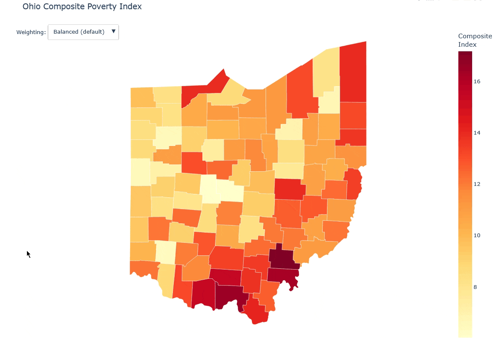

# PovertyMap Ohio

This is a county-level exploration of poverty throughout Ohio's 88 counties. Pulling from multiple public data sources, it combines a variety of factors into a single composite measure of poverty, and then produces an interactive visualization.



## What it does

Many discussions of poverty rely on a single number: the federal poverty rate - but this number only indicates the percentage of people whose income fails to meet a certain threshold. It's not a bad metric for poverty, but it doesn't tell the whole story. This project seeks to expand our understanding of the distribution of poverty by combining multiple complementary data sources, so as to better understand how the geography of economic hardship shifts depending on what you're measuring. It combines poverty rate, unemployment, food insecurity, and severe housing cost burdens.

The data used:

| Measure | Source | Where it comes from | What it captures |
|---|---|---|---|
| Poverty rate | American Community Survey Census 5-Year | US Cencus Bureau | What percent of households are below official income-based poverty thresholds |
| Unemployment rate | Local Area Unemployment Statistics | Bureau of Labor Statistics | What percent of workers are unemployed |
| Food insecurity | County Health Rankings - Food Insecurity | Univ. of Wisconsin Population Health Institute  | What percent of households are lack reliable access to enough food |
| Severe housing cost burden | County Health Rankings - Housing Cost Burden | Univ. of Wisconsin Population Health Institute | What percent of households spend over 50% of monthly income on housing costs |


## Exploring different weights

We can choose to prioritize each measurement differently to explore how shifting our perspective alters the picture. The notebook comes pre-loaded with the following viewpoints (and you can eaisily define your own):
* **Balanced (default)**, *an attempt to get the 'full picture'* : 40% weight to poverty rate, 20% weight to everything else.
* **Income focused**, *a stronger emphasis on below-poverty income levels* : 70% weight to poverty rate, 10% weight to everything else.
* **Material hardship**, *a stronger emphasis on the inability to get food and shelter* : 40% weight to food insecurity and housing burden, 10% weight to everything else.
* **Labor market**, *a stronger emphasis on unemployment* : 70% weight on unemployment, 10% weight to everything else.


## The structure of PovertyMap Ohio

The main part of the project exists in a Jupyter Notebook - an interactive environment for executing code. Most of the notebooks deals with getting the data into a useable format and visualizing it. Here's how everything is set up:

* Section 1 — Setup & Configuration
* Section 2 — Data Acquisition : Get the individual data components, taking it from public sources.
* Section 3 — Clean & Combine : Identify the data we need and strip what we don't, then combine everything together into a single table.
* Section 4 — Composite Index : Define initial weights and see how they affect measurements of poverty.
* Section 5 — Visualize: Put it all together in an interactive map of Ohio's counties, with selections for different weightings.


## Want to run it yourself?

Open up a command line and run the following:

````bash
git clone https://github.com/Nickydoesthings/povertymap-ohio.git
cd povertymap-ohio
pip install -r requirements.txt
jupyter notebook PovertyMap_Ohio.ipynb
````

## Tech stack

Python · pandas · GeoPandas · matplotlib · Plotly · Jupyter
